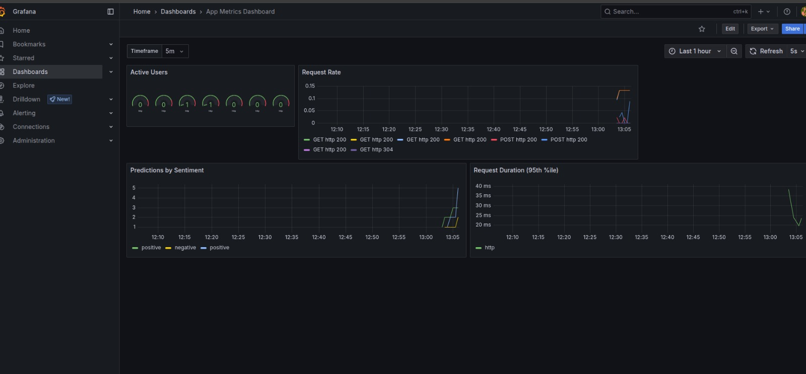

# operation

This is the central repository that contains all information about running the application and operating the cluster.

Group-name: remla2025-team19

You can find all of our repos, by searching org:remla2025-team19 on GitHub.

Links to the code files:

1. App-frontend: https://github.com/remla2025-team19/app-frontend
2. App-service: https://github.com/remla2025-team19/app-service
3. Lib-version: https://github.com/remla2025-team19/lib-version
4. Model-service: https://github.com/remla2025-team19/model-service
5. Model-training: https://github.com/remla2025-team19/model-training
6. Lib-ML: https://github.com/remla2025-team19/lib-ml
7. Operation: https://github.com/remla2025-team19/operation

## Instructions to run the application:

Kindly use the docker-compose file in the operation repository.

Simply execute the command:

```bash
docker compose up
```

This will start the web application, after which you can send your queries to https://localhost:8080

## Major tasks to be completed, refined

1. Automated tagging of images. Currently we have a push based trigger.
2. Better handling of ML weights? We currently store them as GitHub releases.
3. Improved functionality of lib-version

## Instructions for assignment 2

### 1. Provision the cluster

```bash
vagrant up
```

### 2. Finalize the cluster

```bash
ansible-playbook -u vagrant -i 192.168.56.100, ansible/finalization.yml
```

## Instructions for assignment 3

In case of issues in previous step, restart minikube.

```bash
minikube stop
minikube start
```

On running the `finalization.yaml` on the `ctrl` node [Step-2](#2-finalize-the-cluster) , the `sentiment-analyzer` release will be deployed on the worker nodes. The `finalization.yaml`, will also setup one ingress controller. To access grafana and kubernetes dashboard please make the following changes to `/etc/hosts`
```
192.168.56.90 dashboard.local grafana.local
192.168.56.91 app.local
```

All the requirements are met:

-   [x] Helm chart `Chart.yaml` exists in `helm/sentiment-analyzer/`
-   [x] Covers the deployment (app-service and model-service) using `helm/sentiment-analyzer/templates`
-   [x] Service name can be changed via `helm/sentiment-analyzer/values.yaml`
-   [x] Helm chart can be installed more than once. All resources use the prefic {{ .Release.Name }}

Install Prometheus and Grafana using the following command:

```bash
helm repo add prometheus-community https://prometheus-community.github.io/helm-charts
helm repo update
```

Create namespace + CRDs + Prometheus/Alertmanager/Grafana:

```bash
helm upgrade --install monitoring prometheus-community/kube-prometheus-stack \
  --namespace monitoring --create-namespace
```
3. Grafana 

Grafana dashboard can be viewed via:
```http://grafana.local```

Log in with the following default credentials:
```username: admin```
```password: prom-operator```

Click on the ```+``` on the top of the screen to ```import``` the ```helm/sentiment-analyzer/dashboard/dashboard.json``` file.

Ensure the following is present in `/etc/hosts`

```
192.168.56.90 grafana.local
```

On accessing the `grafana.local`. The panels should be visible as below:



## Assignment 5

```bash
vagrant up --provision
ansible-playbook -u vagrant -i 192.168.56.100, ansible/finalization.yml -e "gsc_json=[enter-the-secret-json-base64-encoding]"
```

### Accessing the Sentiment Analyzer Application

After running the finalization playbook, the Sentiment Analyzer app will be available at:

**URL:** http://app.local

#### Prerequisites

1. Add the following to your `/etc/hosts` file:

    ```
    192.168.56.91 app.local
    ```

### Accessing the Kubernetes Dashboard

After running the finalization playbook, the Kubernetes Dashboard will be available at https://dashboard.local (_https is important_):

#### Prerequisites

1. Add the following to your `/etc/hosts` file:

    ```
    192.168.56.90 dashboard.local
    ```

2. Get the authentication token (run on the control node):

    ```bash
    # SSH into the ctrl VM
    ssh vagrant@192.168.56.100

    # Generate a fresh token
    kubectl -n kubernetes-dashboard create token admin-user --duration=8760h

    # Or get the long-lasting token from secret
    kubectl -n kubernetes-dashboard get secret admin-user-token -o jsonpath='{.data.token}' | base64 -d
    ```

3. Copy the token and use it to log into the dashboard at https://dashboard.local

#### Alternative Access Methods

**Port Forward (without ingress):**

```bash
kubectl -n kubernetes-dashboard port-forward svc/kubernetes-dashboard-kong-proxy 8443:443
```

**Debug service issues:**

```bash
# Check if dashboard services are running
kubectl -n kubernetes-dashboard get svc

# Check dashboard pods
kubectl -n kubernetes-dashboard get pods

# Re-apply dashboard configuration
kubectl apply -f ansible/k8s/dashboard.yml
```

Then access via: https://localhost:8443

**Get Token (alternative method):**

```bash
kubectl -n kubernetes-dashboard create token admin-user
```
## Continuous Experimentation
1. Testing the continuous experimentation setup
```bash
kubectl get pods -l app=app
kubectl get pods -l app=model
kubectl get virtualservices
kubectl get destinationrules

```

2. Verify Istio sidecar injection
```bash
kubectl get pods -l app=app -o jsonpath='{.items[*].status.containerStatuses[*].name}'
kubectl get pods -l app=model -o jsonpath='{.items[*].status.containerStatuses[*].name}'

```

3. Generate load for metrics testing
```bash
# Make the script executable
chmod +x generate-experiment-traffic.sh

# Generate traffic for 5 minutes
./generate-experiment-traffic.sh
```

4. Check metrics are being collected
```bash
# Port-forward to Prometheus
kubectl port-forward -n istio-system svc/prometheus 9090:9090 &

# Query metrics (open http://localhost:9090)
# Test queries:
# - num_requests{app="model"}
# - sum(rate(istio_requests_total{destination_app="app"}[1m])) by (destination_version)
# - histogram_quantile(0.95, sum(rate(num_requests_bucket{app="model"}[5m])) by (le, version))

```

5. Access Dashboards
```bash
istioctl dashboard kiali
istioctl dashboard prometheus
```

## Documents
⚠️ A few diagrams may not display as intended in dark mode. For best readability, kindly view these documents in light mode. 

The docs folder contains project related documents for this assignment. 
1. Deployment.md: Describes the final deployment structure and is helpful in understanding overall request flow.
2. Extension.md: Proposes an improvement to our current setup, including experimental design. 
