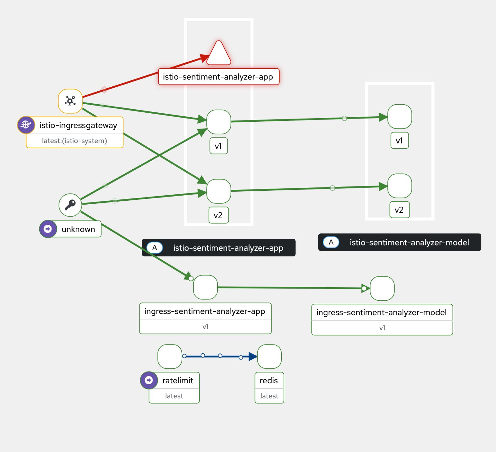

# Final Deployment: System Structure

## System Components

The system consists of the following repositories that interact in the following way:

-   **Frontend**: This is what users interact with - submitting inputs and receiving responses.
-   **Backend**: Frontend sends user inputs to the backend which handles data transfer between the frontend and the model.
-   **Model**: Runs the ML model and makes predictions.
-   **Routing**: For managing inter and intra-service traffic, version splitting, rate limiting and stick sessions.
-   **Prometheus and Grafana**: For scraping and visualising metrics from the running services, on a dashboard.
-   **Kubernetes dashboard**: For inspecting the state of the cluster.

## Cluster Setup

The system runs on a self-provisioned Kubernetes cluster, using Vagrant and Ansible. It helps simulate a production-like environment locally.

### Infrastructure

The infrastructure consists of the following virtual machines:

-   **1 Controller Node**: This runs the kubernetes control plane components. Runs services such as kubeadm, helm, etc.
-   **2 Worker Nodes**: These nodes run application workloads. They join the cluster using tokens generated on the controller node.

### Network Mapping

IPs are assigned by **MetalLB** on the 192.168.56.90-99 range.
Services are discoverable via an NGINX Ingress Controller (192.168.56.90) or Istio Ingress Gateway (192.168.56.91). The domain names are resolved in /etc/hosts:

-   192.168.56.91 app.local
-   192.168.56.90 dashboard.local restaurant.local grafana.local

We manually map these .local domains in /etc/hosts to:

-   http://app.local for frontend
-   http://dashboard.local for the kubernetes dashboard
-   http://monitoring.local

## Helm Deployment

Services are deployed using Helm charts. The `sentiment-analyzer` Helm chart includes:

-   app-service and model-service deployments
-   ConfigMaps for Grafana dashboards
-   ServiceMonitor for Prometheus metric collection
-   Ingress routes for simple deployments with the nginx controller
-   Istio Gateway, Virtualservices, and DestinationRoutes for advanced deployments with multiple versions (ratelimits, a/b testing)

The helm chart can be installed multiple times, as seen in the following screenshot from the Kiali dashboard. It diplays an istio-based and ingress-based deployment side-by-side, as well as the rate limiting service.



## Monitoring

Monitoring is enabled via Prometheus and Grafana. **ServiceMonitor** resources automatically configure Prometheus to scrape metrics from app-service via its /metrics endpoint every 15 seconds. **PrometheusRule** resources define custom alerting based on application metrics. Metrics collected include:

-   Application request rate by version and status code
-   Response time percentiles by service version
-   Model prediction latency and accuracy metrics
-   Rate limiting violations and Redis performance

### Testing

Tests are organised into: Data and Features, Model Development, Infrastructure and Monitoring. Metamorphic tests are also implemented to ensure robustness.

## Service Mesh and Traffic Management

We implement Istio as a service mesh to support advanced traffic control. This also allows for traffic routing and observability.

### Istio Configuration

We extended our deployment to support Istio-based routing. We defined:

-   **Ingress Gateway**: Makes services externally accessible at app.local
-   **Virtual Services**: Define traffic routing with 90/10 canary split and experiment header overrides
-   **Destination Rules**: Map service subsets to version labels and configure load balancing policies
-   **Envoy Filters**: Enable request rate limiting with Redis-backed counters

## Routing Modes

We support the Canary deployment routing. This means incoming requests are split using the 90/10 Split. 90% of requests are routed to `app-service` version `v1` and 10% to `v2`. This allows us to safely test experimental changes in the latter while maintaining uptime for most of the traffic on the former. Additionally, requests with the header `X-Experiment: canary` are always routed to v2.

<<<<<<< HEAD
=======
<p align="center">
  
</p>

>>>>>>> 0c69793 (Add summary of resources, kiali dashboard screenshot, and missing details)
## Sticky Sessions

<<<<<<< HEAD
# Overall Request Lifecycle

<div align="center">
  
  <p><em>Figure 1: Request flow diagram</em></p>
</div>

To summarise the process, the user initiates a request to the following domain: ```http://app.local```. This is manually mapped in /etc/hosts to the IP address of the Istio Ingress Gateway running on the controller node. This allows communication to and from the kubernetes cluster.
=======
We enable sticky sessions based on the X-user header to ensure a consistent experience. We configure Istio's `consistentHash` load balancer policy in the **DestinationRule** to route users with the same X-User header to the same service version consistently. This prevents version flipping for individual users during their session.

## Overall Request Lifecycle

To summarise the process, the user initiates a request to the following domain: `http://app.local`. This is manually mapped in /etc/hosts to the IP address (192.168.56.91) of the **Istio Ingress Gateway** LoadBalancer service running on the cluster.
>>>>>>> 0c69793 (Add summary of resources, kiali dashboard screenshot, and missing details)

The Istio Gateway is configured to listen at port 80 and is the entryway to the service mesh.

The **Envoy Filter** enforces rate limiting on two keys: user id, and path. The **Redis deployment** stores rate limit counters, and the **RateLimit service** processes gRPC requests from Envoy. Per the **ConfigMap** configuration, if the incoming request exceeds the quota (either a single user makes 10 requests per minute or a single path is accessed 100 times a minute), the request is rejected.

The **Virtual Service** handles routing of the request. 100% of requests with header `X-Experiment: canary` are routed to `v2`. For requests without this mention in the header, the 90-10 canary routing is utilised.

Subsets `v1` and `v2` are defined by the **Destination Rule** which maps pod labels to service subsets. The consistent hash load balancing ensures sticky sessions based on the X-User header.

Once the requests are sent to their respective versions of `app-service` , the **model-service** is called via internal cluster networking. The **ConfigMap** provides the model service URL, and **Secrets** provide necessary credentials. Model artifacts are downloaded at runtime and cached in **HostPath volumes**.

A prediction is returned back to the user's browser via the service mesh, with all traffic observable through Istio's built-in telemetry.


## Overview Deployed Resource Types and Relations

Below is a review of the deployed resources, and a summary of their use

### Core Application Resources

-   **Deployments**: `app-deployment` and `model-deployment` with version labels for canary releases
-   **Services**: ClusterIP services exposing app (port 80) and model (port 5001) components
-   **ConfigMaps**:
    -   `app-config`: Contains MODEL_SERVICE_URL, LOG_LEVEL, DB_USER
    -   `model-config`: Contains MODEL_VERSION, ARTIFACT_URL, PREDICTION_THRESHOLD
-   **Secrets**:
    -   `app-credentials`: API_KEY, DB_PASSWORD
    -   `gcp-secret`: Service account credentials for model artifact access

### Istio Service Mesh Resources

-   **Gateway**: `sentiment-gateway` exposes services at app.local on port 80
-   **VirtualService**: `sentiment-virtual-service` implements canary routing (90/10 split) and experiment header routing
-   **DestinationRule**:
    -   `app-dr`: Defines version subsets (v1, v2) with sticky sessions via `X-User` header hashing
    -   `model-dr`: Ensures version consistency between app and model services
-   **EnvoyFilter**: `filter-ratelimit` enforces rate limiting (10 req/min per user, 100 req/min per path)

### Rate Limiting Infrastructure

-   **Redis Deployment**: Backing store for rate limit counters
-   **RateLimit Service**: Envoy rate limiting service with gRPC interface
-   **ConfigMap**: `ratelimit-config` defines rate limiting descriptors and quotas

### Monitoring and Observability

-   **ServiceMonitor**: `sentiment-analyzer` configures Prometheus to scrape /metrics from app services
-   **PrometheusRule**: `sentiment-alerts` defines alerting rules (e.g., HighErrorRate when 500 errors > 0.1/5min)
-   **ConfigMap**: `dashboard` contains Grafana dashboard JSON for automatic import
-   **Prometheus Stack**: kube-prometheus-stack Helm chart providing Prometheus, Grafana, and AlertManager

### Storage and Persistence

-   **HostPath Volumes**: Shared model cache at `/mnt/shared/model_cache` for model artifact storage
-   **Volume Mounts**: Model containers mount cache at `/app/model_cache` for efficient artifact reuse
