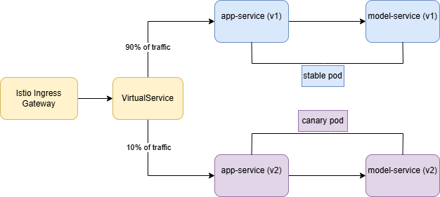
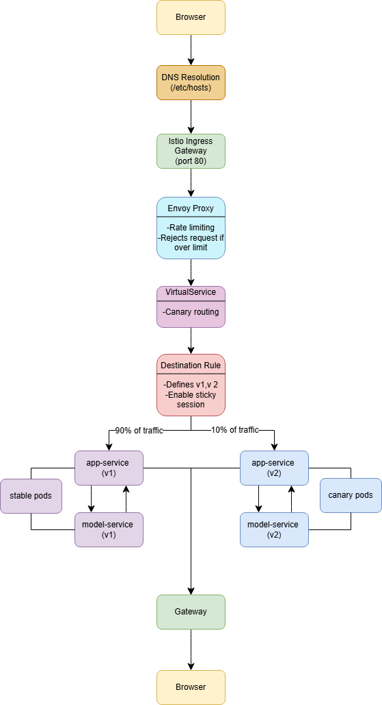

# Final Deployment: System Structure

## System Components
The system consists of the following repositories that interact in the following way:
* Frontend: This is what users interact with - submitting inputs and receiving responses.
* Backend: Frontend sends user inputs to the backend which handles data transfer between the frontend and the model.
* Model: Runs the ML model and makes predictions.
* Routing: For managing inter and intra-service traffic, version splitting, rate limiting and stick sessions. 
* Prometheus and Grafana: For scraping and visualising metrics from the running services, on a dashboard.
* Kubernetes dashboard: For inspecting the state of the cluster.

## Cluster Setup
The system runs on a self-provisioned Kubernetes cluster, using Vagrant and Ansible. It helps simulate a production-like environment locally. 

### Infrastructure
The infrastructure consists of the following virtual machines:
* 1 Controller Node: This runs the kubernetes control plane components. Runs services such as kubeadm, helm, etc.
* 2 Worker Nodes: These nodes run application workloads. They join the cluster using tokens generated on the controller node.

### Provisioning Workflow 
Provisioning is modularised into four Ansible playbooks: ``` general.yml, ctrl,yml, nodel,yml finalization.yml ```

First, we prepare all the nodes with essential packages, set up the SSH keys and ensure they are kubernetes installation ready. Control plane is initialised using ```kubeadm``` and the pod network is set up using Flannel to enable communication. Once ready, the worker nodes join the cluster using tokens generated on the controller node or skip if already part of the cluster. With the cluster set up, finalization sets up networking and observability.

### Network Mapping
Services are discoverable via MetalLB and Istio Ingress Gateway. The domain names are resolved in /etc/hosts: 
* 192.168.56.91 app.local
* 192.168.56.90 dashboard.local

We manually map these .local domains in /etc/hosts to:
* http://app.local for frontend 
* http://dashboard.local for the kubernetes dashboard
* http://monitoring.local 

## Helm Deployment
Services are deployed using Helm charts. The ```sentiment-analyzer``` Helm chart includes:
* app-service and model-service deployments
* ConfigMaps for Grafana dashboards
* ServiceMonitor for Prometheus metric collection

## Monitoring 
Monitoring is enabled via Prometheus and Grafana. Prometheus scrapes metrics from app-service via ServiceMonitor, targeting its /metrics endpoint. Grafana autoimports dashboards from a ConfigMap ```(ansible/grafana/dashboard-configmap.yaml)```. Metrics collected include:
* Application request rate 
* Model latency

## ML Training and Testing Pipeline
The ```model-training``` repository also follows best practices for ML management. The entire pipeline is managed using DVC:
* Stages are defined and reproducible
* Experiment tracking supported
* Evaluation metrics logged
* Google Cloud used for remote storage 

### Code Quality and Linting
The repository includes a CI pipeline to ensure code quality and reliability, configured through GitHub Actions. This setup runs ```pylint``` and ```pytest``` automatically. Metrics recorded during this push are automatically updated in the README. 

### Testing
Tests are organised into: Data and Features, Model Development, Infrastructure and Monitoring. Metamorphic tests are also implemented to ensure robustness.

## Service Mesh and Traffic Management
We implement Istio as a service mesh to support advanced traffic control. This also allows for traffic routing and observability. 

## Istio
We extended our deployment to support Istio-based routing. We defined:
* Ingress Gateway: In order to make our services externally accessible
* Virtual Services: To define how traffic flows into the app
* Destination Rules: Maps subsets to specific service versions with labels.
* Envoy Filters: In order to enable rate limiting for requests to ```app-service```.

## Routing Modes
We support the Canary deployment routing. This means incoming requests are split using the 90/10 Split. 90% of requests are routed to ```app-service``` version ```v1``` and 10% to ```v2```. This allows us to safely test experimental changes in the latter while maintaining uptime for most of the traffic on the former. Additionally, requests with the header 'X-Experiment: canary" are always routed to v2. 

<p align="center">
  
</p>


## Sticky Sessions
We enable sticky sessions based on the X-user header to ensure a consistent experience. We configure Istios ```consistentHash``` load balancer policy to help with the same. We are able to avoid version flipping because of the same.

# Overall Request Lifecycle
To summarise the process, the user initiates a request to the following domain: ```http://app.local```. This is manually mapped in /etc/hosts to the IP address of the Istio Ingress Gateway running on the controller node. This allows communication to and from the kubernetes cluster.

The Istio Gateway is configured to listen at port 80 and is the entryway to the service mesh.

The Envoy Filter enforces rate limiting on two keys: user id, and path. Per the configuration, if the incoming request exceeds the quota (either a single user makes 10 requests per minute or a single path is accessed 100 times a minute), reject the request.

The Virtual Service handles routing of the request. 100% of requests with header ```X-Experiment: canary``` are routed to ```v2```. For requests without this mention in the header, the 90-10 canary routing is utilised.

Versions ```v1``` and ```v2``` are defined by the Destination Rule which corresponds pods to labels. Sticky sessions enable versions being exposed to users consistently across requests. 

Once the requests are sent to their respective versions of ```app-service``` and then ```model-service```, a prediction is returned back to the users browser via the service mesh.

<p align="center">
  
</p>

